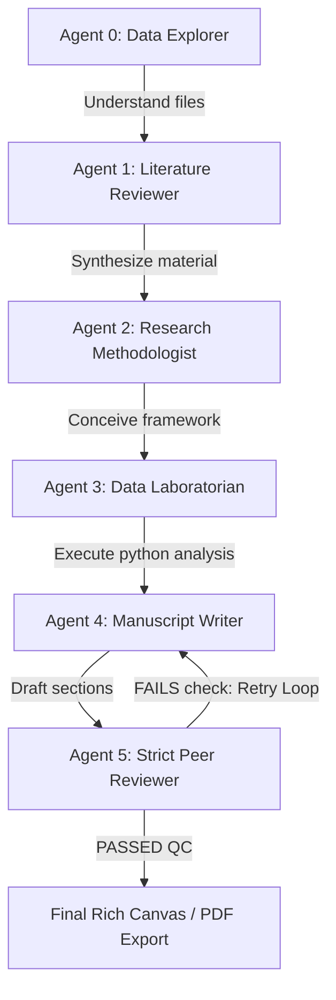

# 🤖 GovGen: Premium Local Multi-Agent Research & Analysis Suite

[](#)
[](#)
[](#)
[](#)

**GovGen** is a premium, state-of-the-art, 100% private **Autonomous Multi-Agent Research Suite** designed to execute complete, end-to-end research pipelines locally. Powered by Google's next-generation **Gemma 4** open LLM family via **Ollama**, GovGen bridges the gap between raw compute models and professional, publication-grade research outputs.

Whether you are drafting scholarly journal papers, public policy analyses, NGO studies, or corporate strategy reports, GovGen's specialized agent workforce collaborates autonomously to execute data science sandboxes, conduct deep literature reviews, draft comprehensive manuscripts, and run stringent peer-review quality controls.

---

## 🎯 Target Domains

GovGen is designed for high-impact research across diverse fields:

*   🎓 **Academic Research:** Generating high-quality journal manuscripts, systematic reviews, dissertations, and research methodologies with strict APA/MLA bibliographic citation integrity.
*   🏛️ **Public Policy & Think Tanks:** Auditing datasets, conducting demographic/socioeconomic impact studies, and drafting detailed policy briefings or legislative whitepapers.
*   🌍 **Public & NGO Projects:** Analyzing local community needs, regional health metrics, and preparing programmatic impact reports.
*   💼 **Private & Corporate Projects:** Conducting private enterprise R&D, market analysis, competitor audits, and engineering research.

---

## 👥 The Specialized Multi-Agent Workforce

GovGen operates an autonomous pipeline of **six collaborative AI agent roles**, each with discrete professional system guidelines:



1.  **🔍 Agent 0: Data Explorer Assistant:** Acts as your initial data-intake specialist. Automatically parses PDF, DOCX, and CSV files, extracts structured text, and helps you understand the shape and boundaries of your raw materials.
2.  **📚 Agent 1: Elite Literature Reviewer:** Conducts systematic academic literature reviews. It ingests your sources, identifies core concepts, builds outlines, and synthesizes scholarly findings without hallucinating claims.
3.  **🧠 Agent 2: Elite Research Methodologist:** Formulates robust, technical, step-by-step methodologies. It details the mathematical models, datasets, statistical paradigms, and algorithmic processes required for your research topic.
4.  **🧪 Agent 3: Elite Data Laboratorian (Python Sandbox):** A full autonomous data scientist. It writes and runs custom Python scripts to analyze your actual CSV/JSON data, executing within a secure local environment. It features a **15-attempt self-correction loop** to debug its own runtime errors and output final charts, stats, and tables.
5.  **📝 Agent 4: Elite Academic Manuscript Writer:** Drafts the actual core sections of your research paper (Introduction, Methodology, Results, Discussion, Conclusion) based on the accumulated project knowledge.
6.  **🧐 Agent 5: Elite Peer Reviewer (Quality Control):** Acts as a rigid, strict gatekeeper. It audits the drafted manuscript section-by-section. If it detects conversational fluff, missing DOIs, or low citation density, it triggers a `FAILS quality check` status, initiating an **autonomous QC rewrite loop** for Agent 4 to self-correct.

---

## ✨ Core Suite Features

*   **🔗 Stateful Chunk-Based Citation Engine:** Outperforms standard LLM citation methods. Programmatically extracts authors, year, and titles from uploaded papers, and uses a stateful, model-agnostic memory framework (highly optimized for small local models) to inject accurate in-text citations.
*   **📊 Integrated Citation Quality Gate:** Automatically analyzes drafted paragraphs to enforce citation density standards, ensuring every claim is supported.
*   **🌐 Semantic Scholar Integration:** Native academic search API integrations let you queries Semantic Scholar's database directly in-app, importing relevant papers and abstracts into your local project environment.
*   **🤖 Built-in Turnitin-Style AI Detector:** Evaluates drafted text for signs of typical AI writing patterns (uniform sentence lengths, transitional hedges like "Moreover" or "It is important to note"), flagging them with visual warning indicators.
*   **🔍 Plagiarism & Similarity Audits:** Compares your drafted sections against the local source literature to perform local similarity checks, flagging high-overlap paragraphs deterministically.
*   **🎨 Premium Interactive Rich Text Canvas:** Powered by **Flutter Quill**, the suite includes a premium, dark-mode first document editor. You can edit Delta-based rich formatting, apply inline formulas, adjust structural layout, and refine the agent-written text interactively.
*   **💾 Local Drift Persistence (SQLite):** Chat logs, settings, literature files, code laboratory history, and project stages are saved locally on your device. Restarts and refreshes will never wipe your data.
*   **📱 LAN & Mobile Access:** Running GovGen hosts a secure local web interface that auto-detects your system's LAN IP, allowing you to run calculations on your desktop and write or review sections from your phone or tablet on the same network.

---

## 🧠 Optimizing for Google's Gemma 4

GovGen is tuned to leverage the incredible reasoning, math, and instruction-following benchmarks of Google's **Gemma 4** open-weight model family. 

### Recommended Gemma 4 Variants:
*   **`gemma4:e4b` (Effective 4B - Default / Recommended):** Exceptional edge/workstation performance. It balances high-fidelity structured formatting and rapid inference speed for local multi-agent steps.
*   **`gemma4:e2b` (Effective 2B):** Optimized for low-compute setups or mobile edge devices.
*   **`gemma4:26b` (MoE):** Perfect for workstations with 16GB+ VRAM, offering dense-like intelligence at a lower active inference cost.
*   **`gemma4:31b` (Dense):** State-of-the-art reasoning, ideal for the Peer Reviewer and Methodologist agents where deep, multi-step planning is paramount.

### Native Thinking Mode Integration
Gemma 4 models support reasoning through native system roles and tokens. To trigger advanced chain-of-thought planning during manual agent chats, simply prefix your instruction or include the `<|think|>` token in your agent directives.

---

## 🛠️ Quick Start

### 1. Prerequisites
- [Flutter SDK](https://docs.flutter.dev/get-started/install) (Stable Channel, version 3.24 or later)
- [Ollama](https://ollama.com/) (Installed and running locally)
- [Python 3.x](https://www.python.org/) (For local Agent 3 python sandboxing)

### 2. Configure Ollama for LAN/Web Connectivity
To allow the Web frontend or mobile devices to connect to your local Ollama backend, set these environment variables before starting Ollama:

#### Windows PowerShell
```powershell
$env:OLLAMA_ORIGINS="*"
$env:OLLAMA_HOST="0.0.0.0"
ollama serve
```

#### macOS/Linux Terminal
```bash
export OLLAMA_ORIGINS="*"
export OLLAMA_HOST="0.0.0.0"
ollama serve
```

### 3. Pull the Gemma 4 Model
```bash
ollama pull gemma4
```
*(This downloads the default `gemma4` variant, which aliases to `gemma4:e4b`)*

### 4. Setup and Launch the Python Backend
GovGen's autonomous python execution laboratory, unified OpenAlex/ArXiv academic searches, and PDF extraction proxy require the FastAPI Python server to be running in the background.

```bash
# Install backend requirements
pip install -r backend/requirements.txt

# Run the FastAPI server locally on http://127.0.0.1:8000
python backend/main.py
```

### 5. Build and Run GovGen Frontend

```bash
# Get Flutter dependencies
flutter pub get

# Build for Web
flutter build web

# Serve the web app locally
npx -y serve build/web
```
*Open your browser and navigate to `http://localhost:3000` (or the LAN IP displayed in the console).*

---

## 📝 License

This project is open-source and available under the **MIT License**.

---
*Built with ❤️ for the global open AI and research community.*
